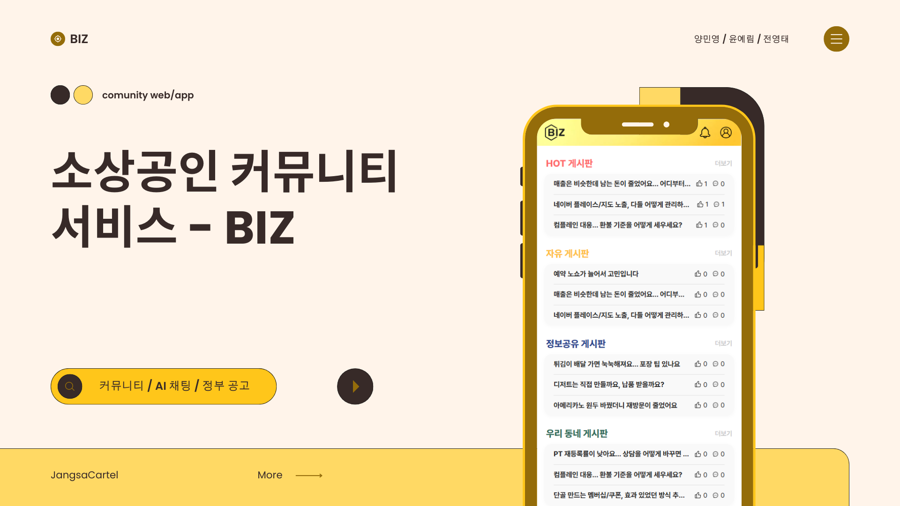
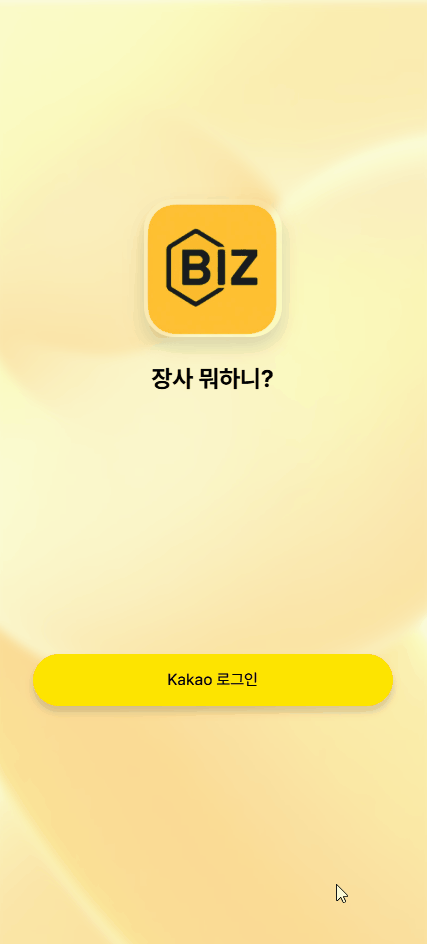
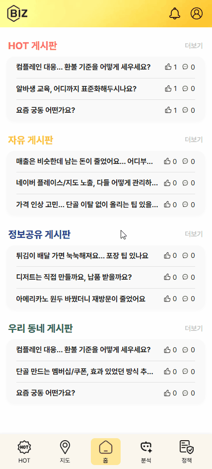
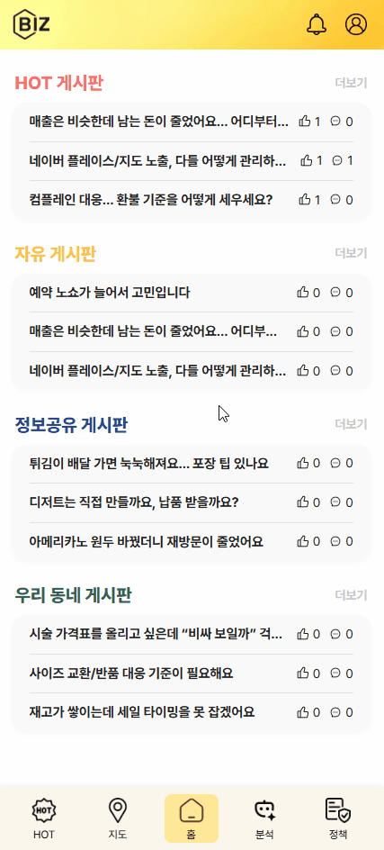
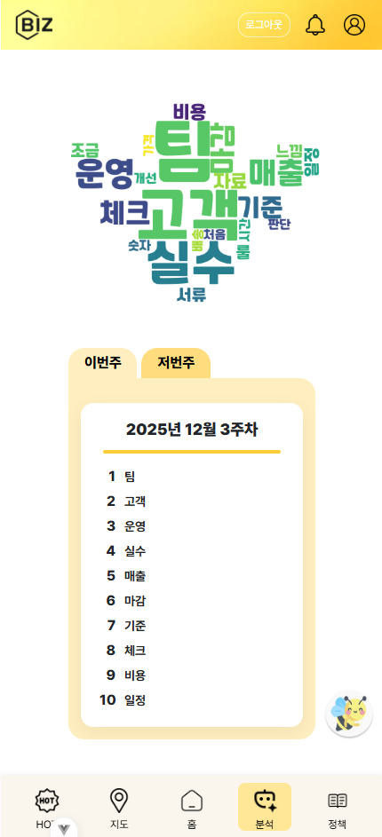
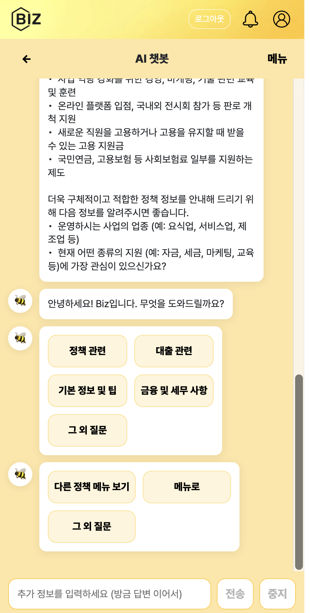
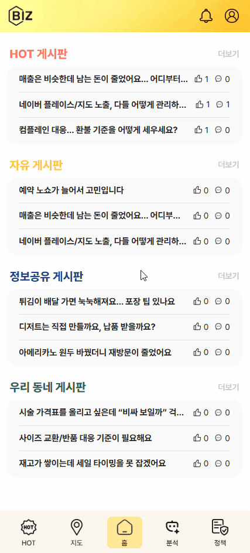
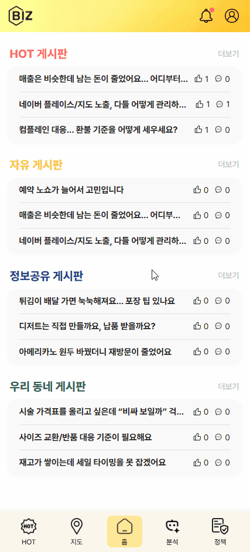
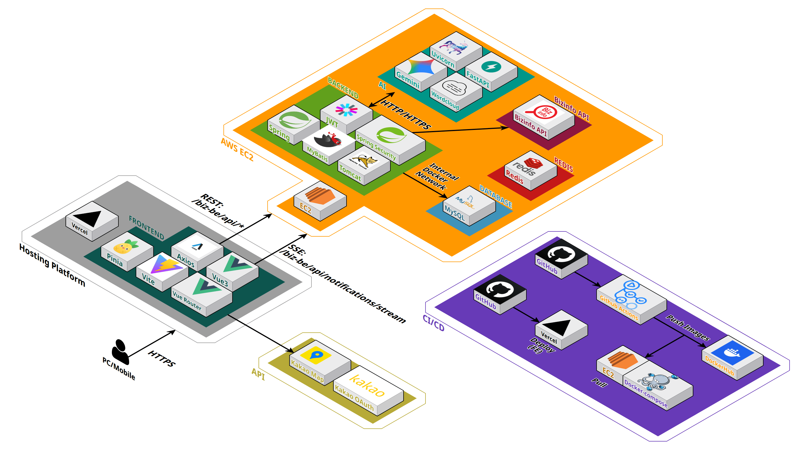
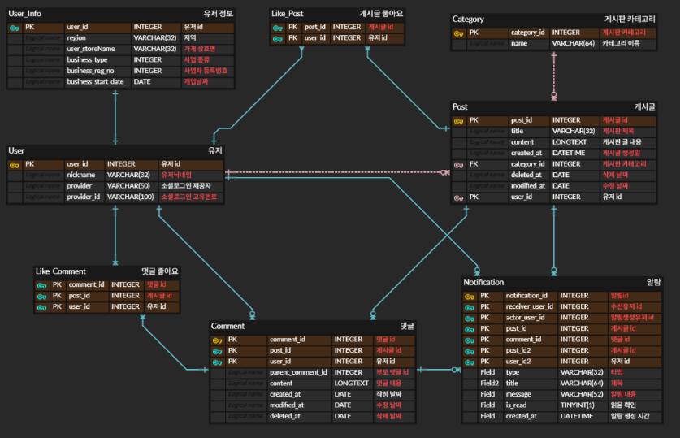

# Biz

소상공인을 위한 공공지원금 정보, 마케팅 팁을 모은 커뮤니티형 플랫폼입니다.



<p align="center">
  <a href="http://biz-fe-roan.vercel.app" target="_blank" rel="noopener noreferrer">
    BIZ 바로가기
  </a>
</p>

## 프로젝트 기간

2025-09-11 ~ 2026-01-30

## 설치 및 실행

### Frontend (Local)

```sh
git clone https://github.com/JangsaCartel/Biz-FE.git
cd Biz-FE

npm install
npm run dev
```

### Backend (Local)

```sh
git clone https://github.com/JangsaCartel/Biz-BE.git
cd Biz-BE

./gradlew clean build

docker run -d -p 8080:8080 --name jc-be-container jc-be
```

### AI (Local)

```sh
git clone https://github.com/JangsaCartel/Biz-AI.git
cd Biz-AI

pip install -r requirements.txt

source .venv/Scripts/activate
python -m uvicorn app.main:app --reload --port 8000 --env-file .env

deactivate
```

## 주요 링크

### Notion 문서

- [🌐 Notion 전체 문서 바로가기](https://minyoung06.notion.site/22ddb7a96218809fb629d23e2e593d49)

### 디자인 시안

- [🖌️ Figma 바로가기](https://www.figma.com/design/tY2YDD1KHi33lSAACC5laO/%EC%9E%A5%EC%82%AC%EB%AD%90%ED%95%98%EB%8B%88-?node-id=2-3&p=f&t=jbpdQ2MFxgZyoyUx-0)

### Swagger

- [⚙️ BE Swagger 바로가기](http://13.158.142.74:8080/swagger-ui.html)

- [🧠 AI Swagger 바로가기](http://13.158.142.74:8000/docs)

## 주요 기능

<details>
<summary>1. 소셜 로그인/회원가입</summary>

> 간편하게 소셜 계정으로 로그인 및 회원가입하여 서비스를 이용할 수 있습니다.

<div align="center">



</div>
</details>
<br/>

<details>
<summary>2. 지원 정책 정보 조회</summary>

> 소상공인을 위한 정부 및 공공기관의 다양한 지원 정책 정보를 조회하고 필터링할 수 있습니다.

<div align="center">


</div>
</details>
<br/>

<details>
<summary>3. 소상공인 커뮤니티</summary>

> 게시판을 통해 소상공인들이 서로의 경험과 정보를 공유하는 커뮤니티 기능을 제공합니다.

<div align="center">





</div>
</details>
<br/>

<details>
<summary>4. AI 기반 트렌드 분석</summary>

> AI를 활용해 특정 상권 또는 업종에 대한 주간 트렌드, 키워드(워드클라우드) 등 분석 정보를 제공합니다.

<div align="center">



</div>
</details>
<br/>

<details>
<summary>5. AI 챗봇 상담</summary>

> 소상공인 정책, 일반 경영 상식 등에 대해 24시간 답변을 제공하는 AI 챗봇 기능입니다.

<div align="center">



</div>
</details>
<br/>

<details>
<summary>6. 지도 기반 정보 제공</summary>

> 지도를 통해 자신의 상권의 소상공인들의 글을 필터링하고 확인할 수 있습니다.

<div align="center">



</div>
</details>
<br/>

<details>
<summary>7. 실시간 알림</summary>

> 새로운 댓글, 게시글 등 주요 커뮤니티 활동에 대한 실시간 알림을 제공합니다.

<div align="center">



</div>
</details>
<br/>

## 🛠️ 기술 스택

### Frontend


### Backend


### AI


### Infra & DevOps


### Design


### Tools


### Collaboration


### Documentation & Version Control


## 🚀 배포 구조


[](#)

### 개요

> **Frontend** → Vercel **자동 배포**

> **Backend** → Docker 이미지 빌드 → **Docker Hub 푸시** → EC2에서 `docker-compose` **배포**

> **Cache/세션** → **Redis (Docker)**

## System Architecture



## ERD



## 👥 팀원

|               [양민영](https://github.com/Minyoung06)               |               [윤예림](https://github.com/StarWhale0w0)               |               [전영태](https://github.com/JeonYeongtae)               |
| :-----------------------------------------------------------------: | :-------------------------------------------------------------------: | :-------------------------------------------------------------------: |
|  |  |  |
|                              FullStack                              |                               FullStack                               |                               FullStack                               |

## 역할

| 이름   | 작업한 페이지 / 기능                                                                                                                                                                                                                                                                                                                                                                                                                                                        | 그 외 작업 사항                                                                                                                                                                                                                                                                                                                              |
| ------ | --------------------------------------------------------------------------------------------------------------------------------------------------------------------------------------------------------------------------------------------------------------------------------------------------------------------------------------------------------------------------------------------------------------------------------------------------------------------------- | -------------------------------------------------------------------------------------------------------------------------------------------------------------------------------------------------------------------------------------------------------------------------------------------------------------------------------------------- |
| 양민영 | • 정책 페이지 (외부 API 요청 로직 구현, 정책 리스트 화면 구현)<br>• 정책 상세 페이지 (외부 API 요청으로 상세 내용 가져오기, 화면 구현)<br>• AI 분석 페이지 (게시글 기준으로 핫 토픽 10개 선정 로직 구현, 워드 클라우드 구현, 화면 구현)<br>• AI 채팅 페이지 (Gemini 활용한 챗봇 구현, 기본 질문/자유 질문 응답 구현, 화면 구현)<br>• 알림 기능 (알림 화면 구현, SSE 활용하여 실시간 알림 기능 구현)                                                                         | • CI 프론트에 구축(Github Actions 활용, discord에 알림 자동화)<br>• PR, Issue template 적용<br>• 피그마 디자인 참여<br>• VSCode 프론트엔드 초기 세팅<br>• Eclipse 백엔드 초기 세팅<br>• ERD 구현 및 최적화<br>• AWS EC2에 BE, AI, DB, Redis 설정 및 배포 <br>• Vercel 사용하여 FE 배포<br>• ReadME 작성, Notion 문서화, 시스템 아키텍처 구현 |
| 윤예림 | • 게시판 전반 (자유/정보/지역별 게시판 목록 및 상세 페이지, 댓글 및 좋아요 등 게시판 부가기능, 글쓰기 페이지 화면 구현 및 개발)<br>• 글쓰기 페이지 (게시글 CRUD 관련 API 엔드포인트 구현, 화면 구현)<br>• 공용 컴포넌트 구현 (AppPagination, ModalDialog, RegionDropdowns 등 재사용 가능한 UI 개발)<br>• 지도 페이지 구현 (Kakao Map API 연동, 위치 기반 필터링 및 검색 백엔드 API 연동)<br>• 스케줄러 구현(데이터베이스 주기적 관리 및 삭제 로직 구현, 시스템 자동화 처리) | • 피그마 디자인 참여<br>• Eclipse 백엔드 초기 세팅<br>• ERD 구현 및 최적화<br>• AWS 기초 세팅 <br>• 공용 DB 구현<br>• ReadME 작성, Notion 문서화, 시스템 아키텍처 구현                                                                                                                                                                       |
| 전영태 | • 로그인/회원가입 페이지(Kakao OAuth 2.0 API 연동 및 액세스 토큰 발급 로직, JWT 발급/검증 로직 구현, Bearer Token 인증 방식 설정 및 보안 로직 적용)<br>• 마이 페이지(정보 조회 및 수정, 회원 탈퇴, 보안 관련 로직 개선, 화면 구현)<br>• Kakao Developers 애플리케이션 등록 및 설정(API Key 발급, 플랫폼 및 Redirect URI 구성)                                                                                                                                               | • 피그마 디자인 담당<br>• 공통 UI 컴포넌트 스타일 리팩토링 및 유지보수 추가 구현 <br>• Notion 문서화                                                                                                                                                                                                                                         |

---
